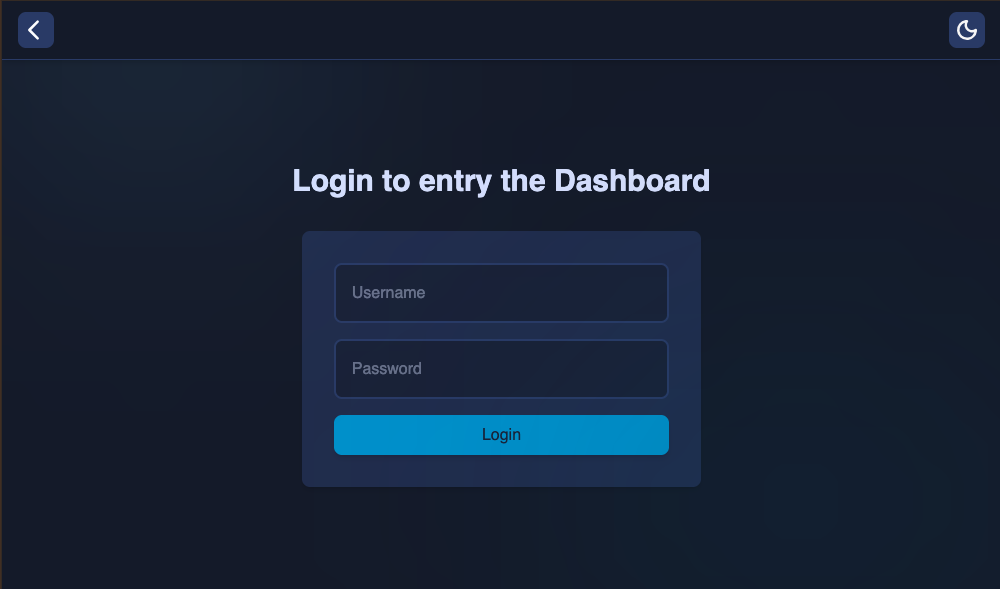
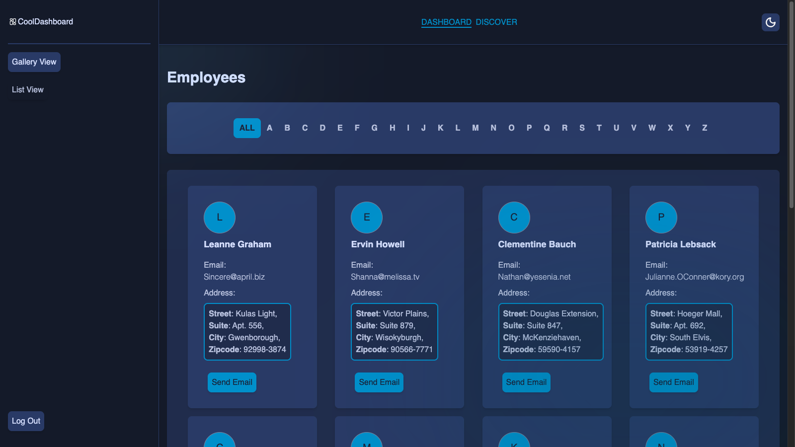
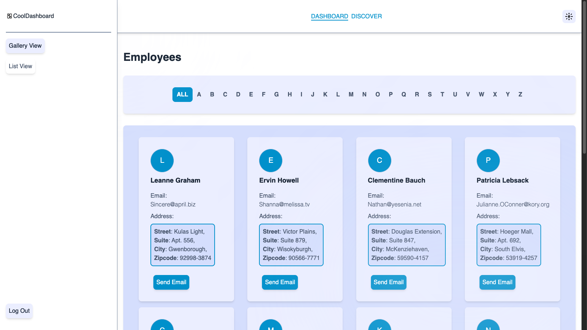
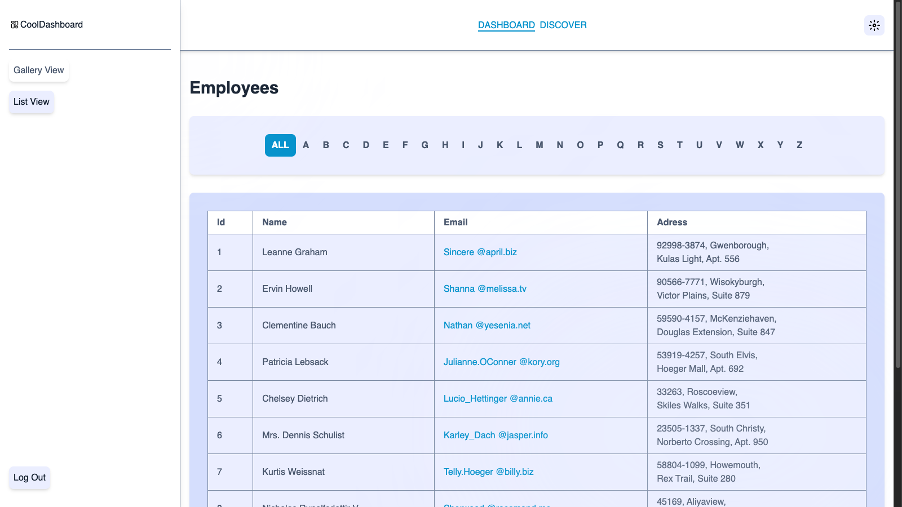
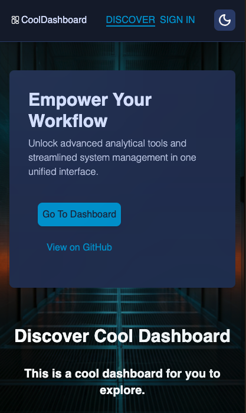
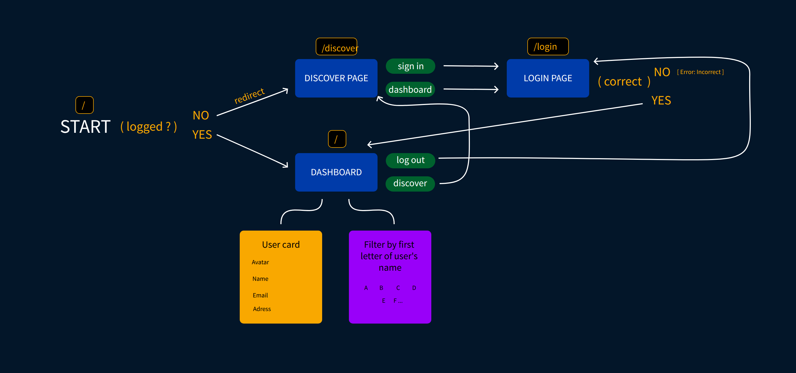
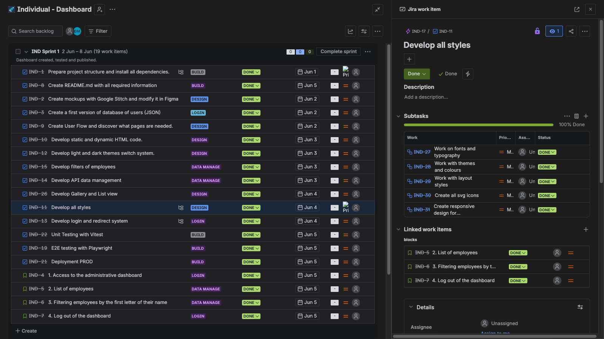
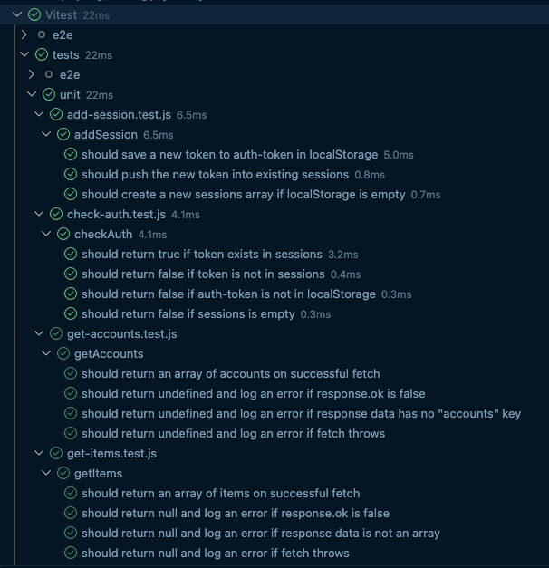
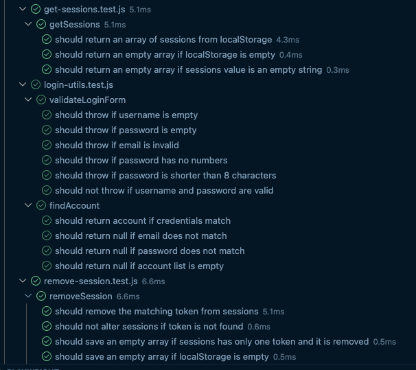
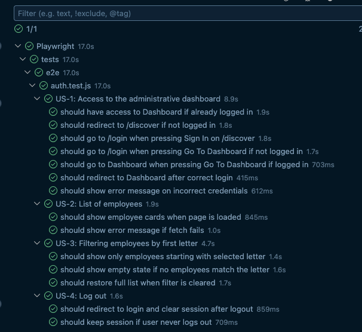

# Cool Dashboard

## About
Cool Dashboard is a web application that allows you to manage your employee with comfort and ease.  
**New Feature in v1.1.0: Dark and Light theme switch**

# Installation 

Start with:

`git clone https://github.com/danyilmuntianu/Cool-Dashboard.git`

 

Then install dependencies:

`npm install`

 

To run tests:

`npm run test`

 

To start the project:

`npm start`

### Stack:
- HTML5, CSS3, JavaScript
- Node.JS
- TailwindCSS
- Vitest
- Playwright

### Metodologies:
Planning:
- SCRUM (User Stories and AC)
- Creating mockups first with Google Stitch and Figma

Design:
- BEM
- Mobile First
- Light and Dark themes

Development:
- Test Driven Development (TDD)
  

# Prototype 
Google Stitch prototypes - [link](https://stitch.withgoogle.com/projects/3344445635291381937)

# Userflow 

# Planning with Jira

# User stories and Acceptance Criteria

### 1. Access to the administrative dashboard
**As** an administrator user  
**I want** to access a dashboard using email and password  
**To** be able to manage employee information

> **Given** the user is on “/“ page / **When**  user already logged / **Then** they have access to Dashboard.

> **Given** the user is on “/“ page / **When** user is not already logged  / **Then** they will be redirected to “/discover“ page with (Sign In) button .

> **Given** the user is on “/discover“ page / **When** they press (Sign In) button / **Then** they will go to “/login“  page.

> **Given** the user is on “/discover“ page / **When** they press (Go To Dashboard) button / **Then** they will go to “/login“  page if not logged in or to dashboard page "/" if logged in.

> **Given** the user is on “/login“ page / **When** they entry correct username and password and press (Sign In) button / **Then** they will be redirected to Dashboard at “/“ page.  

> **Given** the user entry incorrect username and password / **When** they press (Sign In) button / **Then** “wrong password“ message appears

### 2. List of employees
**As** an authenticated administrator user  
**I want** to see a list of employees  
**To** check your basic contact information and address

> **Given** the admin is on Dashboard / **When** the page is fully loaded / **Then** a list of cards of employee appears.

> **Given** the Dashboard page is loading / **When** some error occurred / **Then** “Something went wrong“ message appears

### 3. Filtering employees by the first letter of their name
**As** an authenticated administrator user  
**I want to** filter the employee list by the first letter of their name  
**To** find a specific employee faster

> **Given** the admin is on the employee list / **When** they select a letter (e.g. "M") / **Then** only employees whose name starts with "M" are shown

> **Given** no employees match the selected letter / **When** the filter is applied / **Then** an empty state message is displayed

> **Given** a letter filter is active / **When** the admin clears the filter / **Then** the full employee list is restored

### 4. Log out of the dashboard
**As** an authenticated administrator user  
**I want** to be able to log out from the dashboard  
**So** that no one else can use my open session

> **Given** the authenticated user is at Dashboard page  / **When** they press (Log Out) button  / **Then** they immediately will be redirected to login page and the session will be closed.

> **Given** the authenticated user will never hit the (Log Out) button / **When** they use the same browser / **Then** their session won’t be closed ever.

# Unit Testing (Vitest)

# End-2-End Testing (Playwright)

# Authors
**Danyil Muntianu** 